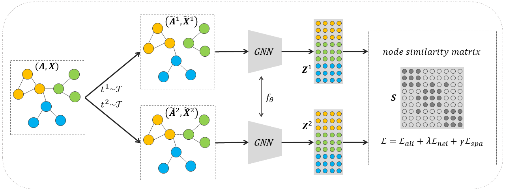

# Sparse Node Similarity Matrix Guided Contrastive Graph Clustering

Official Implementation of Sparse Node Similarity Matrix Guided Contrastive Graph Clustering.

## Abstract

## Dependencies

- PyTorch
- dgl (only as the source of datasets)
- scikit-learn

## Reproduction

Copy hyper-parameters from [params.txt](./params.txt) to [main.py](./main.py) and run it.

## Datasets

For all datasets, we use the processed version provided by [Deep Graph Library](https://github.com/dmlc/dgl).

| Dataset    | Type          | #Nodes | #Edges  | #Features | #Clusters | Homo   |
| ---------- | ------------- | ------ | ------- | --------- | --------- | ------ |
| Cora       | citation      | 2,708  | 10,556  | 1,433     | 7         | 82.52% |
| Citeseer   | citation      | 3,327  | 9,228   | 3,703     | 6         | 72.22% |
| Pubmed     | citation      | 19,717 | 88,651  | 500       | 3         | 79.24% |
| CoraFull   | citation      | 19,793 | 126,842 | 8,710     | 70        | 58.61% |
| WikiCS     | reference     | 11,701 | 431,726 | 300       | 10        | 65.88% |
| Photo      | co-purchase   | 7,650  | 238,163 | 745       | 8         | 83.65% |
| Computer   | co-purchase   | 13,752 | 491,722 | 767       | 10        | 78.53% |
| CoauthorCS | co-authorship | 18,333 | 163,788 | 6,805     | 15        | 83.20% |

## Main Results

| Dataset | Cora              |                   | Citeseer          |                   | Pubmed            |                   | CoraFull          |                   | WikiCS            |                   | Photo             |                   | Computer          |                   | CoauthorCS        |                   |
| ------- | ----------------- | ----------------- | ----------------- | ----------------- | ----------------- | ----------------- | ----------------- | ----------------- | ----------------- | ----------------- | ----------------- | ----------------- | ----------------- | ----------------- | ----------------- | ----------------- |
| Metric  | NMI               | ARI               | NMI               | ARI               | NMI               | ARI               | NMI               | ARI               | NMI               | ARI               | NMI               | ARI               | NMI               | ARI               | NMI               | ARI               |
| KMeans  | 15.44±3.83        | 9.49±2.01         | 20.66±2.83        | 16.80±3.02        | 31.34±0.15        | 28.12±0.03        | 34.52±0.76        | 9.03±0.62         | 25.16±0.31        | 14.50±0.34        | 32.61±0.38        | 20.66±0.91        | 24.26±0.45        | 9.36±0.42         | 66.36±0.70        | 54.47±2.28        |
| SC      | 46.07±0.99        | 34.39±0.98        | 23.95±0.53        | 18.48±0.42        | 28.75±0.00        | 30.34±0.00        | 48.09±0.10        | 21.76±0.40        | 38.80±1.21        | 28.69±1.70        | 52.01±1.72        | 33.85±2.54        | 47.80±1.00        | 32.64±2.24        | 60.52±0.11        | 43.53±0.44        |
| DMoN    | 49.37±0.57        | 38.91±0.54        | 32.19±0.39        | 32.47±0.41        | 29.33±0.67        | 27.30±0.51        | 52.57±0.68        | 24.16±0.63        | 40.14±0.76        | 29.90±0.62        | 62.09±0.45        | 51.77±0.52        | 48.32±0.78        | 26.92±0.81        | 70.59±0.24        | 55.59±0.39        |
|         |                   |                   |                   |                   |                   |                   |                   |                   |                   |                   |                   |                   |                   |                   |                   |                   |
| AGC     | 52.25±0.25        | 43.77±0.18        | 42.28±0.10        | 43.87±0.11        | 31.49±0.01        | 28.34±0.01        | 51.12±0.29        | 17.04±0.58        | 41.08±0.09        | 28.90±0.10        | 64.07±0.04        | 52.16±0.07        | 51.76±0.92        | 37.81±0.21        | 63.12±0.26        | 40.83±0.95        |
| SGC     | 51.41±1.31        | 41.70±3.32        | 43.13±0.19        | 43.67±0.20        | 31.92±0.01        | 30.96±0.01        | 55.70±0.16        | 28.58±0.78        | 43.53±0.94        | 33.10±1.36        | 65.02±0.18        | 49.76±0.18        | 50.46±0.13        | 37.94±0.25        | 70.73±0.33        | 60.29±0.38        |
| SSGC    | 54.32±1.92        | 46.27±4.01        | 42.97±0.08        | 43.54±0.15        | 32.27±0.01        | 31.06±0.01        | <ins>56.41±0.18</ins> | <ins>29.89±0.89</ins> | 43.67±0.06        | 33.35±0.07        | 66.44±0.96        | 51.65±2.40        | 52.05±0.73        | 38.29±1.03        | 72.19±0.41        | 61.58±1.00        |
|         |                   |                   |                   |                   |                   |                   |                   |                   |                   |                   |                   |                   |                   |                   |                   |                   |
| VGAE    | 52.48±1.33        | 43.99±2.34        | 34.46±0.92        | 32.65±0.92        | 27.16±1.45        | 26.32±1.15        | 49.17±0.17        | 19.80±0.44        | 43.64±0.75        | 32.97±0.90        | 67.36±1.58        | 57.00±2.55        | 50.50±1.26        | 30.61±2.16        | 68.49±1.11        | 50.64±3.12        |
| ARVGA   | 51.61±0.60        | 41.88±1.37        | 36.65±0.04        | 36.66±0.03        | 26.03±0.16        | 25.42±0.17        | 49.62±0.16        | 19.47±0.24        | 43.11±0.92        | 31.37±1.39        | 67.01±1.80        | 56.30±3.22        | 50.69±0.97        | 30.95±0.81        | 70.39±1.05        | 53.41±3.00        |
| DAEGC   | 52.89±0.69        | 49.63±0.43        | 39.41±0.86        | 40.78±1.24        | 28.26±0.03        | 29.84±0.04        | 49.16±0.73        | 22.60±0.47        | 41.89±0.60        | 33.24±1.50        | 65.57±0.03        | <ins>59.39±0.02</ins> | 50.87±1.45        | 31.82±2.34        | 70.52±1.23        | 54.23±2.94        |
| GNAE    | 54.20±0.60        | 47.74±1.66        | 33.93±0.02        | 33.00±0.02        | 30.56±0.17        | 31.00±0.15        | 54.42±0.23        | 27.14±0.83        | 43.33±0.50        | 34.69±0.48        | <ins>68.96±0.00</ins> | 58.83±0.00        | 50.22±0.75        | 34.45±0.65        | 73.81±0.68        | 57.71±1.13        |
| EGAE    | 52.83±0.78        | 50.32±0.73        | 38.69±1.76        | 40.51±2.76        | 32.24±0.18        | <ins>32.67±0.09</ins> | 53.92±1.01        | 27.18±0.76        | 42.36±1.05        | 30.26±1.02        | 61.77±1.42        | 50.43±8.35        | 52.25±0.62        | 36.69±0.71        | 71.18±0.98        | 53.98±0.82        |
|         |                   |                   |                   |                   |                   |                   |                   |                   |                   |                   |                   |                   |                   |                   |                   |                   |
| DGI     | 55.82±0.60        | 48.91±1.42        | 41.16±0.54        | 39.78±0.74        | 25.27±0.02        | 24.06±0.03        | 54.61±0.27        | 25.26±0.43        | 43.75±0.25        | 33.64±0.63        | 64.79±0.42        | 56.19±0.70        | 51.30±0.86        | 39.70±1.09        | <ins>75.18±0.70</ins> | 63.39±1.99        |
| MVGRL   | 56.30±0.27        | 50.28±0.40        | 43.47±0.08        | 44.09±0.09        | 27.07±0.00        | 24.53±0.00        | 52.81±0.22        | 23.47±0.54        | 39.22±0.13        | 28.08±0.17        | 62.16±0.71        | 48.71±1.64        | 50.07±0.51        | 37.10±2.05        | 75.15±0.61        | 63.26±1.03        |
| GRACE   | 51.98±0.24        | 46.20±0.53        | 39.07±0.07        | 40.38±0.08        | 22.44±0.02        | 15.62±0.01        | 54.27±0.18        | 25.90±0.53        | 44.69±0.23        | 32.72±0.70        | 66.62±0.02        | 57.01±0.07        | 52.33±0.91        | 34.18±2.59        | 72.58±0.26        | 55.62±0.47        |
| CCASSG  | <ins>56.51±1.49</ins> | 50.77±3.39        | 43.69±0.24        | 44.26±0.23        | 29.61±0.01        | 25.81±0.01        | 55.17±0.19        | 27.37±0.57        | 45.35±0.07        | 36.65±0.04        | 63.89±0.02        | 54.70±0.01        | 52.32±0.41        | <ins>40.88±0.24</ins> | 72.43±0.42        | 59.01±1.94        |
| gCooL   | 50.25±1.08        | 44.95±1.74        | 41.67±0.41        | 42.66±0.47        | **33.14±0.02**    | 31.93±0.01        | 54.21±0.39        | 25.52±0.68        | <ins>46.94±0.03</ins> | <ins>38.33±0.02</ins> | 65.32±0.15        | 56.98±0.13        | 45.67±0.84        | 38.62±0.36        | 73.90±1.13        | 59.43±3.15        |
| CCGC    | 56.45±1.04        | <ins>52.51±1.89</ins> | 44.33±0.79        | 45.68±1.80        | 32.10±0.23        | 30.83±0.41        | 52.88±0.23        | 27.02±0.49        | 42.24±1.37        | 35.64±0.03        | 67.44±0.48        | 54.78±0.04        | <ins>53.79±0.59</ins> | 39.84±0.75        | 73.51±0.56        | <ins>63.93±0.35</ins> |
| SCGC    | 56.10±0.72        | 51.79±1.59        | <ins>45.25±0.45</ins> | **46.29±1.13**    | 31.17±0.81        | 29.23±0.55        | 53.00±0.29        | 24.23±0.86        | 42.74±1.07        | 35.96±1.10        | 67.67±0.88        | 58.48±0.72        | 51.01±0.89        | 34.39±0.73        | 70.21±0.80        | 60.43±0.55        |
|         |                   |                   |                   |                   |                   |                   |                   |                   |                   |                   |                   |                   |                   |                   |                   |                   |
| NS4GC   | **60.34±0.09**    | **58.00±0.46**    | **45.37±0.08**    | <ins>46.08±0.08</ins> | <ins>32.76±0.01</ins> | **33.50±0.01**    | **57.09±0.17**    | **30.42±0.65**    | **48.23±0.32**    | **40.39±1.40**    | **72.55±0.02**    | **62.58±0.02**    | **57.29±0.00**    | **44.56±0.00**    | **78.63±0.90**    | **75.92±3.68**    |

| Dataset | Cora              |                   | Citeseer          |                   | Pubmed            |                   | CoraFull          |                   | WikiCS            |                   | Photo             |                   | Computer          |                   | CoauthorCS        |                   |
| ------- | ----------------- | ----------------- | ----------------- | ----------------- | ----------------- | ----------------- | ----------------- | ----------------- | ----------------- | ----------------- | ----------------- | ----------------- | ----------------- | ----------------- | ----------------- | ----------------- |
| Metric  | ACC               | F1                | ACC               | F1                | ACC               | F1                | ACC               | F1                | ACC               | F1                | ACC               | F1                | ACC               | F1                | ACC               | F1                |
| KMeans  | 34.07±3.21        | 31.39±4.29        | 43.78±3.60        | 41.43±3.72        | 60.11±0.03        | 59.23±0.08        | 25.61±1.12        | 11.39±0.58        | 33.90±1.09        | 30.17±1.30        | 41.52±0.71        | 40.92±1.61        | 26.30±0.48        | 21.16±0.37        | 60.13±2.64        | 52.26±2.84        |
| SC      | 59.09±1.15        | 59.79±1.35        | 45.95±0.65        | 43.77±1.51        | 66.63±0.00        | 65.18±0.00        | 33.01±0.46        | 22.21±0.53        | 51.16±1.34        | 43.48±2.87        | 60.26±2.41        | 55.04±3.31        | 49.80±1.59        | 44.57±2.42        | 55.56±1.03        | 50.98±1.44        |
| DMoN    | 62.64±0.48        | 57.67±0.45        | 57.59±0.67        | 53.53±0.59        | 66.42±0.46        | 62.69±0.33        | 35.25±0.96        | 28.25±0.92        | 44.54±0.82        | 36.37±0.78        | 70.04±0.63        | 59.87±0.66        | 37.52±0.71        | 26.85±0.90        | 63.74±0.54        | 53.87±0.65        |
|         |                   |                   |                   |                   |                   |                   |                   |                   |                   |                   |                   |                   |                   |                   |                   |                   |
| AGC     | 67.93±0.21        | 63.46±0.23        | 68.29±0.08        | 63.89±0.06        | 63.44±0.02        | 62.65±0.02        | 38.01±0.50        | 32.54±0.59        | 52.57±0.09        | 43.66±0.12        | 71.09±0.05        | 65.19±0.04        | <ins>56.12±0.18</ins> | <ins>46.47±1.52</ins> | 56.91±0.76        | 43.90±0.42        |
| SGC     | 63.63±2.92        | 59.06±4.78        | 68.30±0.20        | 64.32±0.15        | 68.51±0.01        | 68.06±0.01        | 40.49±0.90        | 32.94±0.82        | 54.74±2.00        | 43.27±1.77        | 67.57±0.02        | 60.62±0.26        | 55.08±0.54        | 45.66±0.46        | 69.47±0.91        | 66.99±2.19        |
| SSGC    | 69.28±3.70        | 64.70±5.53        | 68.23±0.18        | 64.16±0.13        | 68.61±0.01        | 68.22±0.01        | 41.46±1.25        | <ins>34.57±1.10</ins> | <ins>54.81±0.07</ins> | 44.88±0.10        | 68.71±3.06        | 61.96±3.52        | 55.21±0.49        | 42.49±2.73        | 69.68±1.23        | 64.99±2.19        |
|         |                   |                   |                   |                   |                   |                   |                   |                   |                   |                   |                   |                   |                   |                   |                   |                   |
| VGAE    | 64.54±1.98        | 64.50±1.37        | 59.97±0.72        | 57.29±0.59        | 66.08±0.71        | 64.85±0.80        | 31.23±0.58        | 25.81±0.54        | 49.69±0.66        | 42.03±0.67        | 73.66±2.27        | 69.94±1.87        | 46.08±1.81        | 40.31±4.01        | 61.80±1.69        | 53.67±1.15        |
| ARVGA   | 65.48±1.08        | 66.89±0.66        | 64.48±0.04        | 61.50±0.05        | 65.55±0.10        | 64.23±0.10        | 29.91±0.48        | 24.86±0.45        | 49.42±1.75        | 42.32±2.16        | 73.54±2.53        | 65.76±3.74        | 46.27±1.17        | 42.06±1.62        | 63.70±1.93        | 57.54±2.31        |
| DAEGC   | 70.43±0.36        | 68.27±0.57        | 67.54±1.39        | 62.20±1.32        | 68.73±0.03        | 68.23±0.02        | 34.35±1.00        | 26.96±1.33        | 51.92±1.06        | 42.09±0.71        | 76.44±0.01        | 69.97±0.02        | 49.22±1.56        | 42.45±3.43        | 64.22±1.88        | 59.02±2.42        |
| GNAE    | 69.12±1.50        | 68.67±1.13        | 58.96±0.03        | 54.96±0.03        | 69.03±0.09        | 67.94±0.11        | 39.43±1.12        | 30.82±1.07        | 52.30±0.33        | 43.58±0.41        | 77.10±0.00        | 70.81±0.00        | 53.74±0.63        | 42.97±0.77        | 65.62±2.36        | 61.14±4.13        |
| EGAE    | 72.86±0.46        | 68.67±0.58        | 66.21±1.89        | 61.03±2.32        | 68.98±0.21        | 67.69±0.14        | 39.97±0.87        | 28.52±0.77        | 48.73±1.67        | 41.92±1.04        | 73.67±0.79        | 69.30±0.76        | 53.12±0.35        | 45.52±0.46        | 63.67±1.37        | 60.80±1.26        |
|         |                   |                   |                   |                   |                   |                   |                   |                   |                   |                   |                   |                   |                   |                   |                   |                   |
| DGI     | 70.89±1.05        | 68.37±1.44        | 63.31±1.20        | 60.00±1.83        | 65.01±0.02        | 65.38±0.02        | 36.52±0.56        | 31.58±0.63        | 51.54±0.82        | 44.13±1.71        | 75.78±0.67        | 70.52±1.16        | 54.36±1.20        | 39.95±1.52        | <ins>70.77±2.56</ins> | <ins>68.87±3.86</ins> |
| MVGRL   | 72.03±0.17        | 68.36±0.53        | 68.03±0.06        | 63.66±0.04        | 64.11±0.00        | 64.96±0.00        | 35.18±0.84        | 29.92±0.74        | 45.26±0.18        | 40.28±0.15        | 70.54±0.66        | 64.58±0.93        | 53.22±1.13        | 38.38±0.40        | 69.15±2.19        | 64.02±3.52        |
| GRACE   | 68.28±0.30        | 65.67±0.44        | 65.83±0.06        | 62.59±0.05        | 56.30±0.01        | 56.40±0.01        | 37.38±0.82        | 32.41±0.76        | 50.82±1.99        | 43.31±2.25        | 74.87±0.05        | 70.58±0.03        | 50.62±1.97        | 41.14±2.50        | 63.64±1.48        | 60.23±2.76        |
| CCASSG  | 71.89±2.52        | <ins>70.98±1.65</ins> | 69.26±0.20        | 63.87±0.21        | 64.49±0.01        | 63.96±0.01        | 38.01±0.59        | 31.42±0.63        | 53.84±0.03        | 43.19±0.02        | 74.03±0.02        | 67.74±0.02        | 53.43±0.03        | 42.99±0.46        | 65.83±1.15        | 57.18±1.76        |
| gCooL   | 67.40±1.43        | 65.50±1.17        | 66.98±0.32        | 63.23±0.33        | <ins>69.97±0.02</ins> | <ins>68.90±0.03</ins> | 38.93±0.96        | 32.42±1.01        | 53.64±0.23        | <ins>45.04±0.07</ins> | 75.97±0.01        | <ins>73.10±0.14</ins> | 50.09±1.10        | 30.10±1.07        | 66.19±3.14        | 61.00±4.17        |
| CCGC    | 73.88±1.20        | 70.98±2.79        | <ins>69.84±0.94</ins> | 62.71±2.06        | 68.78±0.56        | 68.35±0.71        | 39.69±0.49        | 26.98±0.73        | 49.61±1.49        | 41.12±1.26        | 77.25±0.41        | 72.18±0.57        | 54.70±0.81        | 42.09±0.74        | 70.16±0.88        | 67.63±0.71        |
| SCGC    | <ins>73.88±0.88</ins> | 70.81±1.96        | **71.02±0.77**    | <ins>64.80±1.01</ins> | 68.66±0.45        | 68.05±0.31        | <ins>41.89±0.47</ins> | 32.98±0.73        | 50.53±1.03        | 40.34±0.95        | <ins>77.48±0.37</ins> | 72.22±0.97        | 51.76±1.05        | 39.03±1.65        | 69.18±0.55        | 62.76±1.21        |
|         |                   |                   |                   |                   |                   |                   |                   |                   |                   |                   |                   |                   |                   |                   |                   |                   |
| NS4GC   | **76.33±0.15**    | **74.23±0.08**    | 69.70±0.03        | **65.08±0.08**    | **70.56±0.01**    | **69.49±0.01**    | **42.12±0.56**    | **34.84±0.63**    | **57.39±1.89**    | **49.98±2.35**    | **79.38±0.01**    | **73.33±0.01**    | **58.21±0.00**    | **48.58±0.00**    | **78.63±2.22**    | **73.68±3.83**    |

